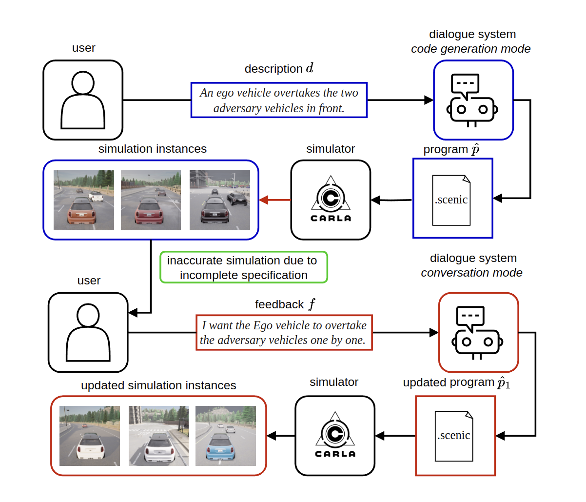

# Conversational Code Generation: a Case Study of Designing a Dialogue System for Generating Driving Scenarios for Testing Autonomous Vehicles


[paper](https://arxiv.org/abs/2410.09829) | [dataset](https://huggingface.co/datasets/assistive-autonomy/scenic-driving-scenarios)



Cyber-physical systems like autonomous vehicles are tested in simulation before deployment, using domain-specific programs for scenario specification. To aid the testing of autonomous vehicles in simulation, we design a natural language interface, using an instruction-following large language model, to assist a non-coding domain expert in synthesising the desired scenarios and vehicle behaviours. We show that using it to convert utterances to the symbolic program is feasible, despite the very small training dataset. Human experiments show that dialogue is critical to successful simulation generation, leading to a 4.5 times higher success rate than a generation without engaging in extended conversation.


## Setup

### Prerequisites

- Linux (tested on Ubuntu 22.04)
- Python 3.10
- An NVIDIA GPU with ≥ 24 GB VRAM (the default config loads CodeLlama-7B-Instruct in 4-bit)
- [CARLA 0.9.15](https://github.com/carla-simulator/carla/releases/tag/0.9.15) installed at `~/CARLA_0.9.15` (only required for human evaluation / running simulations; not needed for the automatic evaluation pipeline)
- A [Weights & Biases](https://wandb.ai/) account (free tier is fine)

### 1. Clone the repository

```bash
git clone https://github.com/assistive-autonomy/scenic-driving-scenarios#
cd scenic-driving-scenarios
```

### 2. Create and activate a virtual environment

```bash
python3.10 -m venv venv
source venv/bin/activate
```

### 3. Install dependencies

```bash
pip install --upgrade pip
pip install -r requirements.txt
```

Verify the install:

```bash
scenic --version  # should print "Scenic 2.1.0"
python -c "import torch, transformers, wandb; print('imports OK')"
```

### 4. Authenticate with Weights & Biases

```bash
wandb login
```

Then open [`config/default.yaml`](config/default.yaml) and set `wandb.entity` to your W&B username or team:

```yaml
wandb:
  use_wandb: True
  project: "scenic-driving-scenarios"
  entity: ""  # <-- insert your W&B username/team here
```

If you want to disable W&B logging entirely, set `use_wandb: False`.

### 5. (Optional) Install CARLA for simulation

Download CARLA 0.9.15 from the [official release page](https://github.com/carla-simulator/carla/releases/tag/0.9.15) and extract it to `~/CARLA_0.9.15`. The simulation script ([`scripts/simulate.sh`](scripts/simulate.sh)) launches `~/CARLA_0.9.15/CarlaUE4.sh`.


## Experiments

All commands below assume the venv is activated and you are at the repository root.

### Automatic evaluation

Generates Scenic programs from each English description in the dataset and reports BLEU, ROUGE-L, perplexity, and compile/sample success.

```bash
cd src
python exp.py
```

To change settings (e.g. disable error-feeding, change the model, point W&B at a different project), edit [`config/default.yaml`](config/default.yaml).

### Human evaluation (dialogue interface)

Launches the Gradio app for interactive scenario generation. Requires CARLA installed.

```bash
cd src
python app.py
```


## Citation

```
@inproceedings{rubavicius2025conversationalcodegenerationcase,
title = {Conversational Code Generation: a Case Study of Designing a Dialogue System for Generating Driving Scenarios for Testing Autonomous Vehicles},
author = {Rimvydas Rubavicius and Antonio Valerio Miceli-Barone and Alex Lascarides and Subramanian Ramamoorthy},
url = {https://arxiv.org/abs/2410.09829},
year = {2025},
date = {2025-09-08},
booktitle = {Proceedings of GeCoIn 2025: Generative Code Intelligence Workshop, co-located with the 28th European Conference on Artificial Intelligence
(ECAI-2025)
}
```
