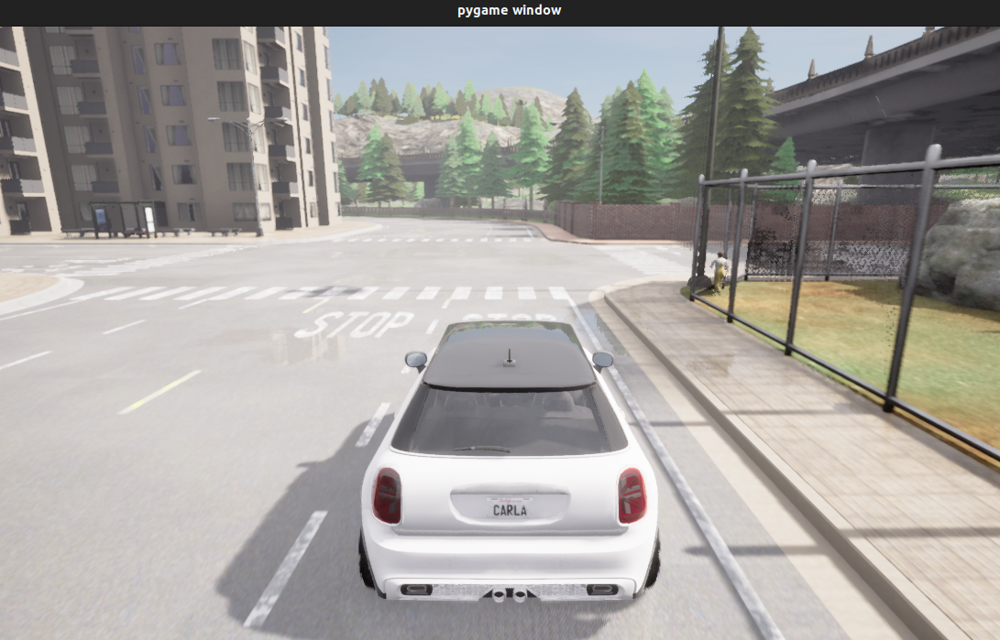
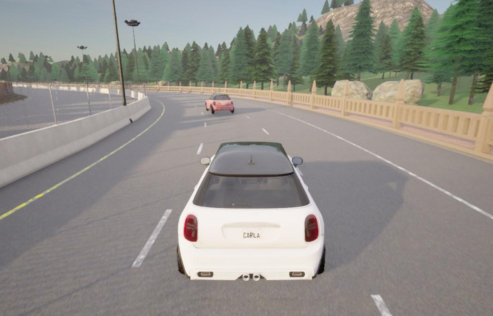
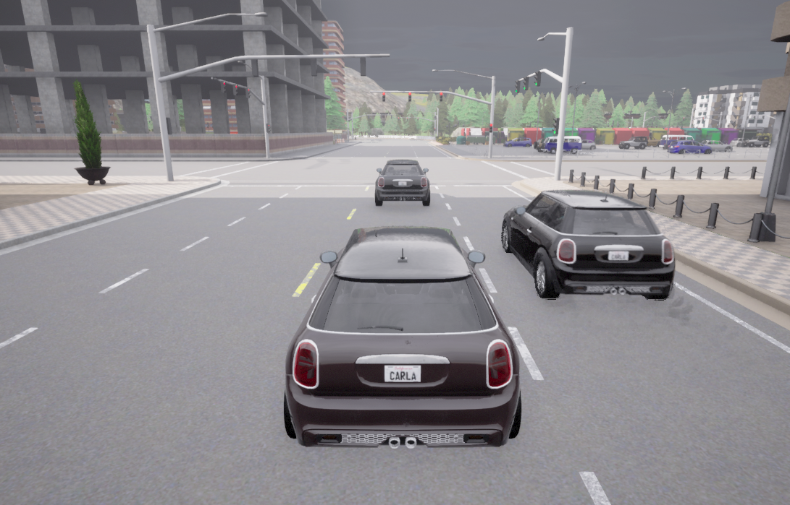

# Conversational Driving Scenario Generation

Generating Driving Scenarios in Conversation for CARLA driving Scenarios

  

## Setup

Install [CARLA 0.9.15](https://carla.org/) in your home directory

```bash
pip install -r requirements.txt 
```

## Experiments

Automatic Evaluation

```bash
python scripts/rag.py
```

Human Evaluation

```bash
python scripts/app.py
```
